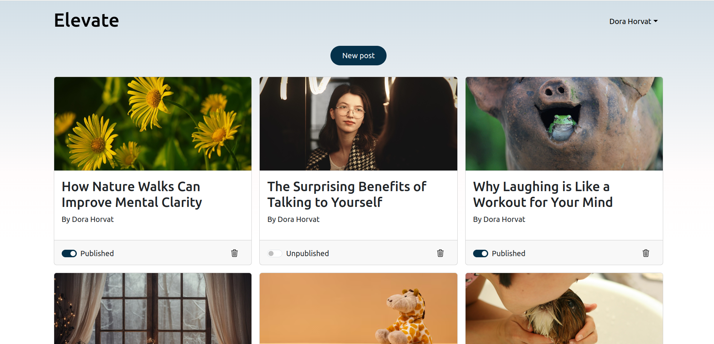

# Elevate

This is the admin frontend for managing the blog. Only authorized users can access it.

## Features

- Login with admin credentials
- Manage blog posts
- Manage user comments

## Tech Stack

- Vite (React)
- React Router
- Bootstrap

## Screenshot

## Installation

1. Clone the repository
2. Install dependencies: npm install
3. Set up environment variables (.env file): VITE_API_BASE_URL
4. Start the development server: npm run dev
